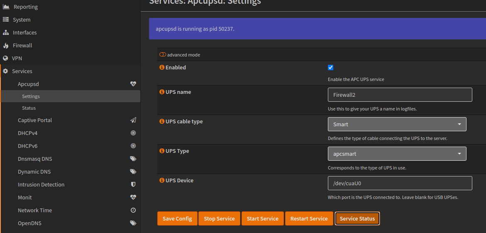
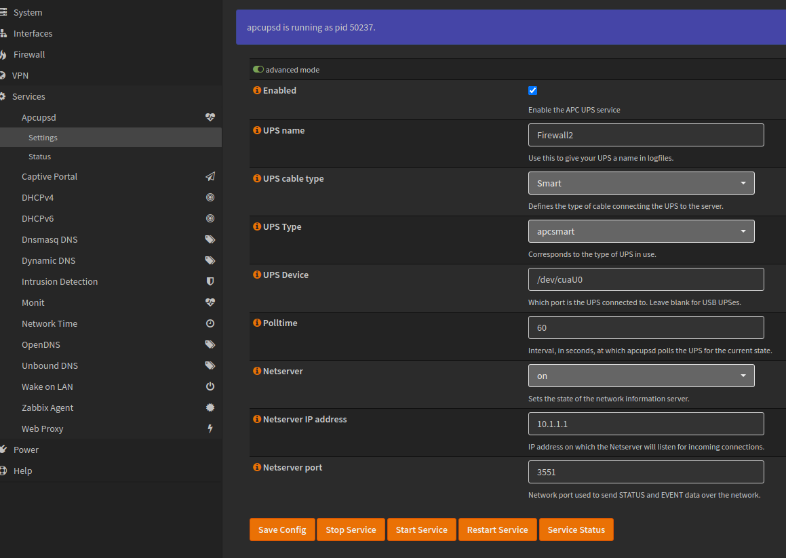
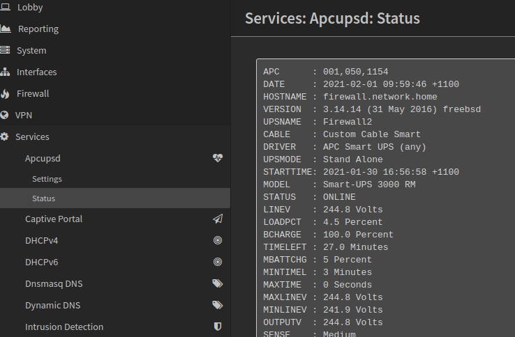
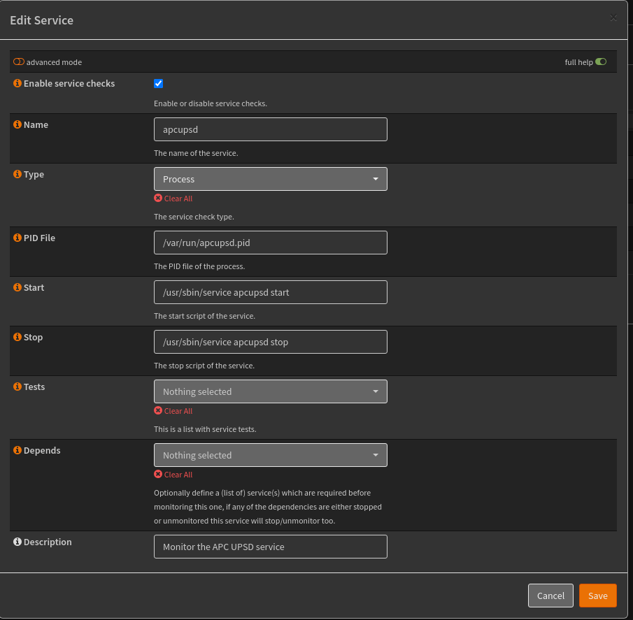

=======
APCUPSD
=======

APC UPS plugin for OPNsense

This plugin allows you to configure a APC UPS for use with OPNsense. The setup page allows you to set the most common options for connecting your UPS to your OPNsense server.

This is the main settings page:

These are the advanced options available:

The status page shows you information about the connected UPS:

You can use the OPNsense Monit service to control the apcupsd service.  The Monit service monitors the PID file of the apcupsd daemon, and restarts it should it fail.

The monit service can be configured like this:

